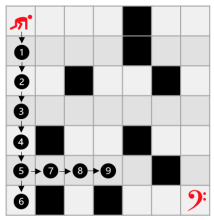
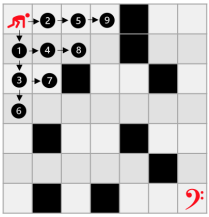
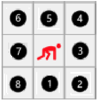

> Status Development: finished :heavy_check_mark:

# Labirinto por Profundidade (DFS) e Largura (BFS)

Criado em Maio de 2023, o projeto <strong>Labirinto por Profundidade (DFS) e Largura (BFS)</strong> foi desenvolvido em virtude de atender as demandas do curso de Algoritimo e Estrutura de Dados, ministrado pelo professor <a href="https://www.linkedin.com/in/michelpiressilva/?originalSubdomain=br" target="_blank">Michel Pires Da Silva</a> no Centro Federal de Educação Tecnológica de Minas Gerais (<a href="https://www.divinopolis.cefetmg.br/" target="_blank">CEFET-MG</a>). Segundo as diretrizes, o projeto foi redigido por uma equipe composta de três mebros: <a href="https://github.com/LuanLuL/" target="_blank">Luan Gonçalves Santos</a>, <a href="https://github.com/teuswx" target="_blank">Mateus Herique Pereira</a> e <a href="https://github.com/MatheuAlves/" target="_blank">Matheus Henrique Alves</a>.

## Objetivo 🎯

Este projeto, tem o propósito de contemplar três modelos de caminhamento em matriz: randômico, busca em profundidade (DFS) e busca em largura (BFS).

O caminhamento deve ocorrer em uma única matriz de tamanho N x N (considere testes para matrizes grandes, alto em torno de 50 x 50 ou maior). Nesta haverá quatro tipos de elementos importantes espalhados aleatoriamente: (a) item de passagem livre (número 1 na posição da matriz); (b) item de dano, indicado pelo carácter ‘*’; (c) paredes definidas como ‘#’ e; por fim, (d) uma ‘?’ que indica o ponto de parada da exploração. Esse, por sua vez, estará posicionado de forma randômica na matriz em qualquer uma das posições tidas como válidas. Além disso, tem-se como regra a condição de dano. Consideramos dano o item ‘*’, o qual obriga o algoritmo a voltar no estágio inicial de execução e reiniciar novamente do zero toda a execução.

Ao sofrer um dano o algoritmo deve demarcar a posição com o item 1, neutralizando o mesmo e abrindo novas possibilidades de caminhamento / rotas até o estágio de finalização. Isso permitirá induzir custo adicional ao processo, o que nos ajudará a concluir várias questões sobre composição da entrada vs modelo de execução vs comportamento do algoritmo. Observe que a cada dano tomado o algoritmo deve ser reiniciado do zero, começando TODO o processo de caminhamento novamente a partir do estado inicial de execução.

Espera-se para este trabalho um README.mb contemplando uma discussão aprofundada da comparação entre caminhamento randômico, BFS e DFS. Neste documento é importante que se tenha fatores comparativos de velocidade de execução e quantidade de passos para a finalização do labirinto. Além disso, espera-se de cada equipe uma profunda discussão em forma de texto científico que relate o modelo de funcionamento de cada algoritmo e os motivos que tornam uma das soluções a melhor opção sob uma análise criteriosa da entrada fornecida. Observe que para isso é preciso realizar várias execuções com mesma entrada, alternar as parametrizações da entra item a item, bem como, avaliar a relação tamanho vs tempo vs espaço. Por fim, una-se com mais três equipes e compare as diferentes implementações, discuta as diferenças e quais os ganhos obtidos e porque esses são produzidos.

O objetivo do programa é encontrar uma flag de parada representada pelo símbolo '?' utilizando três métodos de busca diferentes: Depth-First Search (DFS), Breadth-First Search (BFS) e um algoritmo de busca aleatório. Durante a execução do código, os algoritmos irão encontrar obstáculos como paredes represetadas por '#' e perigos '*' na matriz, o que dificultará a localização da flag de parada.

## Lógica :bulb:

O projeto foi desenvolvido para ler várias matrizes de um arquivo de entrada chamado 'input.data'. Cada matriz é quadrada e as informações sobre a quantidade de matrizes, número de linhas e número de colunas são fornecidas na primeira linha do arquivo. Além disso, o projeto inclui a implementação de estruturas dinâmicas de pilha e fila nos arquivos 'pilha.hpp', 'pilha.cpp', 'fila.hpp' e 'fila.cpp'.

Primeiramente, com o objetivo de diminuir os casos de erros e otimizar as verificações, a matriz de entrada é alterada. Essa mudança consiste em cercar a matriz original por parades, possibilitando que todas as posições da matriz possam ser tratadas de forma padronizada. Feito isso, é empregado os diferentes tipos de caminhamento.

### Depth-First Search

A ideia principal por trás do DFS é explorar o caminho mais profundo, visitando o máximo possível em uma unica direção antes de explorar as outras. Dessa forma, a DFS explora o máximo possível em profundidade antes de retroceder. Para isso, a estrutura de dados chamada de pilha é utilizada com o intuito de controlar a ordem das posições visitadas. Veja o processo detalhadamente na Figura 1.
 

    
      <strong>Figura 1:</strong> Busca em profundidade controlada por pilha

### Depth-First Search

Para o BFS a ideia é percorrer  o caminho utilizando o conseito de  de busca em largura, o que significa que ele visita todas as posições a uma distância k da raiz antes de prosseguir para as posições a uma distância k + 1. O algoritmo utiliza uma fila para controlar a ordem em que as posições são exploradas. A primeira posição a ser visitado é colocada na fila, e então seus vizinhos são adicionados. O processo continua até que todos as posições tenham sido visitados ou a condição de parada seja atingida. Observe mais na Figura 2.
 

    
      <strong>Figura 2:</strong> Busca em largura controlada por fila

### Caminhamento Randômico

O método randômico busca encontrar o caminho de forma completamente aleatória. Sua fundamentação é baseada em trabalhos passados, como [O Labirinto Recorrente](https://github.com/teuswx/O-Labirinto-Recorrente/blob/master/README.md). Portanto, as ideias implementadas seguem a mesma linha de racioncínio.

É importante destacar que o tanto o caminhamento por DFS, quanto por BFS seguem a mesma orientação, a qual é no sentido anti-horário, iniciando por baixo. Observe a ordem de prioridade do caminhamento na Figura 2:
 

    
      <strong>Figura 3:</strong> Ordem de prioridade considerada pelos algoritmos

## Exemplo de execução :hammer: 

<!--COLOCAR FIGURA DO output junto com os tempos de execução-->

## Análise dos Tempos de Execução :bar_chart:

Tempo de execução do caminho controlado por DFS:

<!--COLOCAR FIGURA DO TEMPO DE EXECUÇÃO-->

Tempo de execução do caminho controlado por BFS:

<!--COLOCAR FIGURA DO TEMPO DE EXECUÇÃO-->

Tempo de execução do caminho aleatório:

<!--COLOCAR FIGURA DO TEMPO DE EXECUÇÃO-->

## Perguntas ❓

**1. qual foi o menor tempo de execução entre os algoritmos?**

**2. Qual o custo computacional gerado por cada algoritmo?**

## Conclusão :ballot_box_with_check:

Durante o desenvolvimento do algoritmo, criou-se três abordagens distintas para resolver o problema de caminhamento em matrizes. Essa diversidade permitiu a comparação e analisasse o desempenho de cada algoritmo. Essa análise foi extremamente valiosa, pois proporcionou um aprendizado significativo sobre técnicas de otimização de código.

Ao comparar os algoritmos, foi possível observar as diferenças em termos de tempo de execução e eficiência. Essa comparação ajudou a identificar as abordagens mais eficientes e compreender quais técnicas de otimização de código são mais adequadas para resolver o problema proposto. Essa experiência proporcionou uma base sólida para o aprimoramento das habilidades do grupo na programação.

## Compilação e Execução :electric_plug:

O programa foi feito de acordo com a proposta e possui um arquivo Makefile que realiza todo o procedimento de compilação e execução. Para tanto, temos as seguintes diretrizes de execução:
| Comando                |  Função                                                                                           |                     
| -----------------------| ------------------------------------------------------------------------------------------------- |
|  `make clean`          | Apaga a última compilação realizada contida na pasta build                                        |
|  `make`                | Executa a compilação do programa utilizando o gcc, e o resultado vai para a pasta build           |
|  `make run`            | Executa o programa da pasta build após a realização da compilação                                 |

