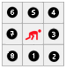
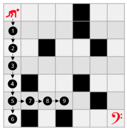
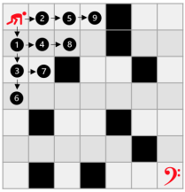

# Labirinto por Profundidade (DFS) e Largura (BFS)

Criado em Maio de 2023, o projeto <strong>Labirinto por Profundidade (DFS) e Largura (BFS)</strong> foi desenvolvido em virtude de atender as demandas do curso de Algoritimo e Estrutura de Dados, ministrado pelo professor <a href="https://github.com/mpiress" target="_blank">Michel Pires Da Silva</a> no Centro Federal de Educação Tecnológica de Minas Gerais (<a href="https://www.divinopolis.cefetmg.br/" target="_blank">CEFET-MG</a>). Segundo as diretrizes, o projeto foi redigido por uma equipe composta de três mebros: <a href="https://github.com/LuanLuL/" target="_blank">Luan Gonçalves Santos</a>, <a href="https://github.com/teuswx" target="_blank">Mateus Herique Pereira</a> e <a href="https://github.com/MatheuAlves/" target="_blank">Matheus Henrique Alves</a>.

## Objetivos 🎯

Este projeto, tem o propósito de contemplar um programa de computador que seja capaz de encontrar uma flag de parada representada pelo símbolo '?' utilizando três métodos de busca diferentes: Depth-First Search (DFS), Breadth-First Search (BFS) e um algoritmo de busca aleatório. Durante a execução do código, os algoritmos irão encontrar obstáculos que dificultaram a localização da flag de parada.

O caminhamento deve ocorrer em matrizes de tamanho N x N (considerando testes para matrizes grandes). Nesta haverá três tipos de elementos importantes espalhados aleatoriamente: item de passagem livre (número 1 na posição da matriz), item de dano, indicado pelo carácter '*' e paredes definidas como '#'. Existe também a flag de parada que, por sua vez, estará posicionada de forma randômica na matriz em qualquer uma das posições tidas como válidas.

Além disso, ao encontrar um posição de dano o algoritmo deve voltar no estágio inicial, reiniciando toda a sua  execução. Isto é, no momento em que o caminhamento se deperar com um '*' o algoritmo deve demarcar a posição com o item 1, neutralizando o mesmo e abrindo novas possibilidades de caminhamento/rotas até o estágio de finalização e recomeçar.

## Lógica :bulb:

O projeto foi desenvolvido para ler várias matrizes através de um arquivo do tipo DATA chamado input. Seguindo essa perspectiva, é imprescindível que as informações sobre o número de linhas, número de colunas e quantidade de matrizes devem ser fornecidas, respectivamente, na primeira linha do arquivo — observe o padrão no '<a hreft="https://github.com/LuanLuL/AEDS---Labirinto_DFS-BFS/blob/main/dataset/input.data">input.data</a>'.  Além disso, o projeto inclui a implementação de estruturas dinâmicas como a pilha e a fila para auxiliar na gerência dos dados em memória.

Ademais, com o objetivo de diminuir os casos de erros e otimizar as verificações, o software altera a entrada durante o seu processamento. Essa mudança consiste em cercar a matriz original por parades, possibilitando que todas as posições dela sejam tratadas de forma padronizada. Feito isso, é empregado os diferentes tipos de caminhamento.

Antes da estratégias de caminhamento serem devidamente apresentadas , é importante destacar que o tanto o caminhamento por DFS, quanto por BFS seguem a mesma orientação, a qual é no sentido anti-horário, iniciando por baixo. Observe a ordem de prioridade do caminhamento na Figura 1:
 

    
      <strong>Figura 1:</strong> Ordem de prioridade considerada pelos algoritmos

### Busca em profundidade (DFS)

A ideia principal por trás do DFS é explorar o caminho mais profundo, visitando o máximo possível em uma unica direção antes de explorar as outras. Dessa forma, o algotimo de busca em profundidade explora o máximo possível em profundidade antes de retroceder. Para isso, a estrutura de dados chamada de pilha é utilizada com o intuito de controlar a ordem das posições visitadas. Veja o processo detalhadamente na Figura 1.
 

    
      <strong>Figura 2:</strong> Busca em profundidade controlada por pilha

### Busca em largura (BFS)

Para o BFS a ideia é percorrer o caminho utilizando o conseito de busca em largura, o que significa que ele visita todas as posições a uma distância k da raiz antes de prosseguir para as posições a uma distância k + 1. O algoritmo utiliza uma fila para controlar a ordem em que as posições são exploradas. A primeira posição a ser visitado é colocada na fila, e então seus vizinhos são adicionados. O processo continua até que todos as posições tenham sido visitados ou a condição de parada seja atingida. Observe mais na Figura 2.
 

    
      <strong>Figura 3:</strong> Busca em largura controlada por fila

### Caminhamento Randômico

O método randômico busca encontrar o caminho de forma completamente aleatória. As ideias implementadas seguem linhas de racioncínio implementadas trabalhos passados. Logo, sua explanação pode ser visualizada em [O Labirinto Recorrente](https://github.com/teuswx/O-Labirinto-Recorrente/blob/master/README.md).

## Funcionamento :hammer: 

De acordo com o proposto, um dos requisitos do algoritmo é conseguir sustentar matrizes grandes. Visando que o usuário pode inserir várias matrizes no arquivo de entrada, o ideal é que apenas uma matriz seja carregada na memoria por vez. Sendo assim, o algoritmo lê o arquivo de entrada de tempos em tempos selecionando somente uma matriz a cada leitura.

A partir disso, o caminhamento em profundidade, em largura e o randômico são, respectivamente, processados para todas as matrizes encontradas no arquivo de entrada. Como resultado, foi-se medido, por meio da biblioteca <a hreft="https://cplusplus.com/reference/chrono/">chrono</a>, o  tempo de execução de todos os métodos. levando em consideração a entrada do <a hreft="https://github.com/LuanLuL/AEDS---Labirinto_DFS-BFS/blob/main/dataset/input.data">input.data</a>. Segue a Tabela 1 contendo os dados.

        <table>
            <thead>
                <tr>
                    <th>
Função
</th>
                    <th colspan="5">
Tempos (segundos)
</th>
                    <th>
Média (segundos)
</th>
                </tr>
            </thead>
            <tbody>
                <tr>
                    <td>DFS</td>
                    <td>0.0004232</td>
                    <td>0.0004477</td>
                    <td>0.0016552</td>
                    <td>0.0004056</td>
                    <td>0.0017993</td>
                    <td>0.0009462</td>
                </tr>
                <tr>
                    <td>BFS</td>
                    <td>0.0012844</td>
                    <td>0.0011983</td>
                    <td>0.000929</td>
                    <td>0.0016357</td>
                    <td>0.0012859</td>
                    <td>0.00126666 </td>
                </tr>
                <tr>
                    <td>Aleatório</td>
                    <td>0.002972</td>
                    <td>0.0076198</td>
                    <td>0.01387</td>
                    <td>0.0058208</td>
                    <td>0.0466705</td>
                    <td>0.01559046</td>
                </tr>
            </tbody>
        </table>
        

            <b>Tabela 1:</b> Tempo de execução dos algoritmos
        

    

Podemos verificar que, para essa entrada, o algoritmo que apresentou o menos custo de execução foi e DFS, com um tempo médio de 0.0009462 segundos. Por outro lado, a maior média foi a do aleatório, com o tempo de 0.01559046 segundos.

## Análise dos Tempos de Execução :bar_chart:

## Conclusão :ballot_box_with_check:

Durante o desenvolvimento do algoritmo, criou-se três abordagens distintas para resolver o problema de caminhamento em matrizes. Nesse sentido, a diversidade permitiu a comparação e análises do desempenho de cada algoritmo. Essa análise foi extremamente valiosa, pois proporcionou um aprendizado significativo sobre técnicas de otimização de código.
    
Portando, ao comparar os algoritmos, foi possível observar a eficiência de cada  um dos três tipos de algoritmo. Isso possibilitou identificar as melhores abordagens, compreendendo quais técnicas de otimização de código são mais adequadas para resolver os problemas propostos. De modo igual, a experiência adquirida acrescenta uma base sólida para o aprimoramento das habilidades do grupo na programação.

## Compilação e Execução :electric_plug:

    Durante o deselvovimento do algoritimo apresentado nesse repositório, foi-se utilizado de três principais tecnologias: Visual Studio Code e WSL:Ubunto.

<ul>
    <li>    
        

            O Visual Studio Code é um editor de texto multiplataforma disponibilizado pela Microsoft para o desenvolvimento de aplicações, Conhecer essa ferramenta é importante para os desenvolvedores que pretendem trabalhar em ambientes multiplataforma, por exemplo,  podendo operar o desenvolvimento em ambiente Mac e Linux, ao mesmo tempo em que mantém o projeto compatível com Windows. Segue em anexo o link para o site da plataforma — <a href="https://code.visualstudio.com/" target="_blank">Visual Studio Code</a>.
        

    </li>
    <li>
        
O WSL é um método para se executar o Sistema Operaciona Linux dentro do Windows de forma muito facil. Essa platoforma se torna essencial para o desenvovimento em ambiente GNU Linux, evitando tarefas como a intalação de maquinas vituais, criação de dual booting no computador pessoal e entre outras coisas. Além disso, existem diversas vantagens como rodar programas em conjunto e compartihamento de localhost. Segue em anexo um  tutorial de download do WSL2 — <a href="https://youtu.be/hd6lxt5iVsg" target="_blank">Tutorial WSL2</a>.

    </li>
</ul>

Por fim, visando dimuir o tempo de processamento do programa de computador é empregado o arquivo Makefile que realiza todo o procedimento de compilação e execução. Para tanto, segue anexado na Tabela 1, as diretrizes de execução no padrão make:

| Comando                |  Função                                                                                           |                     
| -----------------------| ------------------------------------------------------------------------------------------------- |
|  `make clean`          | Apaga a última compilação realizada contida na pasta build                                        |
|  `make`                | Executa a compilação do programa utilizando o gcc, e o resultado vai para a pasta build           |
|  `make run`            | Executa o programa da pasta build após a realização da compilação                                |

    <strong>Tabela 2:</strong> Comandos úteis para compilar e executar o software

